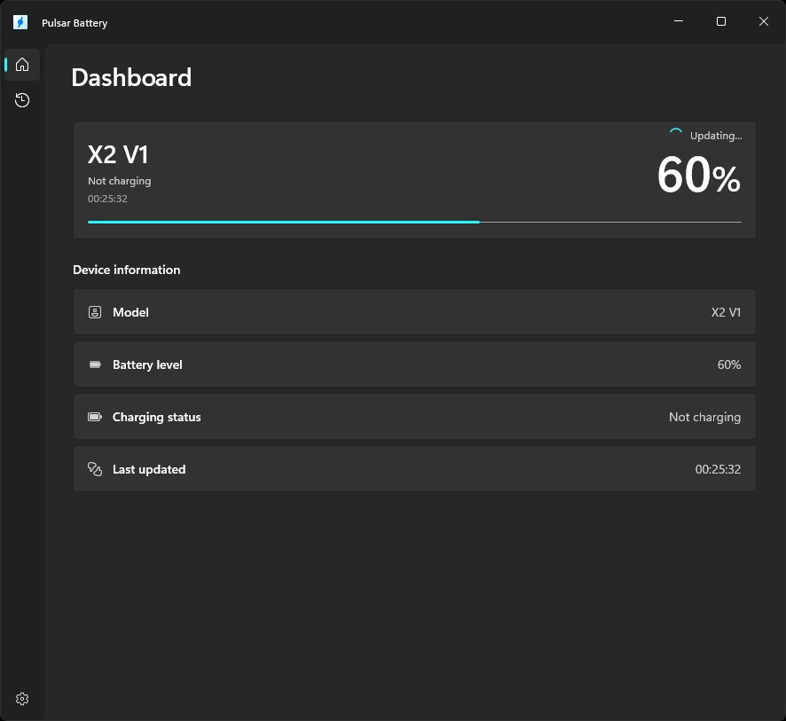

# Pulsar Battery

This project is a simple battery level indicator for Pulsar mice using the hidapi library. It provides a visual representation of the battery status and alerts the user when the battery is low.



## Inspiration

This project is inspired by https://github.com/jonkristian/pulsar-x3-python/

## Supported Devices

- X2 CrazyLight
- X2 V1

## Build (Visual Studio)

Prereqs:
- Visual Studio 2022 (17.8+).
- Workload: "Desktop development with .NET".
- Windows 10/11 SDK (10.0.19041.0 or newer).

Steps:
1. Open `PulsarBattery.slnx`.
2. Set configuration to `Debug` and platform to `x64`.
3. Set `PulsarBattery` as the startup project, then run.

## Standalone publish (single-file)

The publish profiles are set up to bundle the .NET runtime and Windows App SDK into the app and produce a single main `.exe`.

From Visual Studio:
1. Right-click `PulsarBattery` > Publish.
2. Select the `win-x64` profile and Publish.
3. Output is in `PulsarBattery\bin\Publish\win-x64\`.

From CLI:
```
dotnet publish .\PulsarBattery\PulsarBattery.csproj -c Release -p:Platform=x64 -p:PublishProfile=win-x64
```
Output is in `PulsarBattery\bin\Publish\win-x64\` with `PulsarBattery.exe`.

## Startup (tray only)

To start the app in the background (tray only) without opening the window:

```
PulsarBattery.exe --background
```

If you want it to run on login, create a shortcut in the Windows Startup folder and add `--background` (or `--tray`) to the shortcut target.

Startup folder:
```
%APPDATA%\Microsoft\Windows\Start Menu\Programs\Startup
```

## Related Projects

This project is a .NET split-off of https://github.com/Elehiggle/SimplePulsarBatteryNotification.

That project also documents how the mouse was debugged to determine the data format.

## Contributing

Contributions are welcome! If you find any issues or have suggestions for improvements, please open an issue or submit a pull request.

## License

This project is licensed under the MIT License. See LICENSE.md for details.
