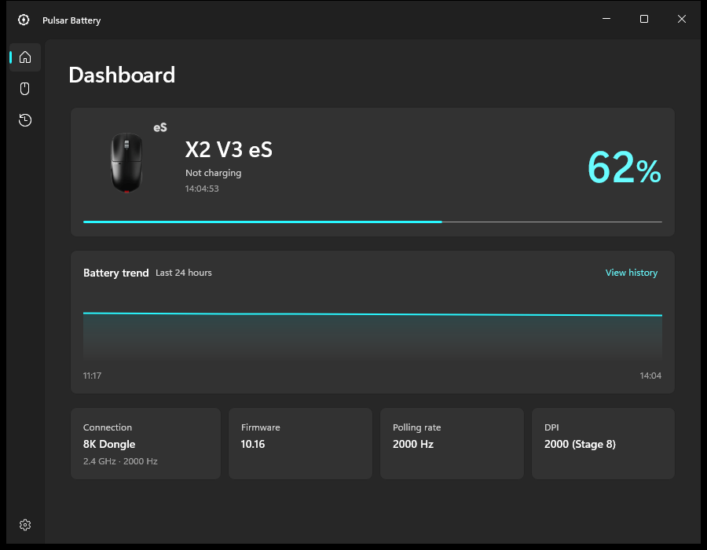

<p align="center">
  
</p>

<h1 align="center">Pulsar Battery</h1>

Pulsar Battery is a small Windows app that keeps an eye on the battery of your Pulsar wireless mouse. It sits in the system tray, shows the current charge, and warns you before the battery runs out. For newer mice it can also change the mouse settings, so no extra software is needed.



## Features

- Battery level, charging state and device info at a glance
- Change mouse settings like DPI and polling rate directly from the app
- Notifications when the battery runs low
- Tray icon showing the current battery percentage
- Battery history over time
- Optional start with Windows
- Available in English and German

## Supported Devices

| Device or family | VID | PID matching | Protocol | Settings support |
|---|---|---|---|---|
| Pulsar cMouse V1.31 CID-87 family | `0x3710` | 50 candidate PIDs | 17-byte reports | Read and write (verified on X2 CrazyLight; other models enabled but unverified) |
| X2 V1 | `0x25A7` | `0xFA7B` wired, `0xFA7C` dongle | 17-byte reports | Read-only settings |
| X2 V3 eS | `0x3710` | `0x3406` wired, `0x5403` dongle | 64-byte feature reports | Read and write |

The cMouse entry is a snapshot of the devices listed by Pulsar cMouse V1.31, not a claim that every Pulsar mouse is supported. Several editions share the same underlying mouse and receiver, so Pulsar Battery identifies each device itself before applying settings rather than guessing from the USB PID alone.

The `0x5403` "8K Dongle" is a shared Pulsar accessory (also used by the X3 family), so other mice paired to it may work as well. Devices speaking the 64-byte protocol get the full Mouse settings page, firmware version, and live polling rate. The X2 V3 eS protocol was reverse-engineered for this project since eS models have no official software.

## Build (Visual Studio)

Prereqs:
- .NET 10 SDK (or a Visual Studio installation with .NET 10 support).
- Visual Studio workload: "Desktop development with .NET".
- Windows SDK 10.0.22000.0 or newer; Windows 11 21H2 or newer.

Steps:
1. Open `PulsarBattery.slnx`.
2. Set configuration to `Debug` and platform to `x64`.
3. Set `PulsarBattery` as the startup project, then run.

## Standalone publish (single-file)

The publish profiles are set up to bundle the .NET runtime and Windows App SDK into the app and produce a single main `.exe`.

From Visual Studio:
1. Right-click `PulsarBattery` > Publish.
2. Select the `win-x64` profile and Publish.
3. Output is in `PulsarBattery\bin\Publish\win-x64\`.

From CLI:
```
dotnet publish .\PulsarBattery\PulsarBattery.csproj -c Release -p:Platform=x64 -p:PublishProfile=win-x64
```
Output is in `PulsarBattery\bin\Publish\win-x64\` with `PulsarBattery.exe`.

Protocol tests do not access HID hardware and can be run separately:

```
dotnet test .\PulsarBattery.Device.Tests\PulsarBattery.Device.Tests.csproj -c Release
```

## Startup (tray only)

To start the app in the background (tray only) without opening the window:

```
PulsarBattery.exe --background
```

If you want it to run on login, create a shortcut in the Windows Startup folder and add `--background` (or `--tray`) to the shortcut target.

Startup folder:
```
%APPDATA%\Microsoft\Windows\Start Menu\Programs\Startup
```

## Related Projects

- [pulsar-x3-python](https://github.com/jonkristian/pulsar-x3-python/) inspired this project.
- [SimplePulsarBatteryNotification](https://github.com/Elehiggle/SimplePulsarBatteryNotification) base project as python application. It also documents how the mouse was debugged to determine the data format.
- [Bibimbap](https://github.com/amassias/Bibimbap) documents and validates the same cMouse 17-byte protocol on X2 CrazyLight hardware.
- [OpenPulsar](https://github.com/Andalrick/OpenPulsar) is a Linux alternative.

## Contributing

Contributions are welcome! If you find any issues or have suggestions for improvements, please open an issue or submit a pull request.

## License

This project is licensed under the MIT License. See LICENSE.md for details.
